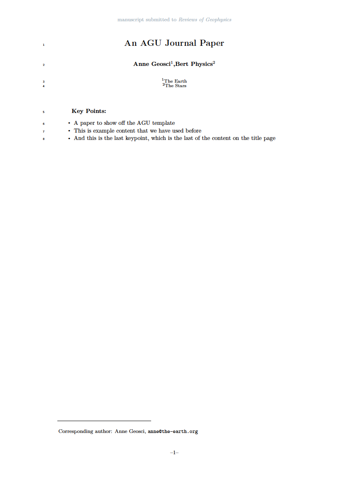

# AGU Journal (2019)

The offical 2019 AGU Journal template, ported to a `jtex` template with minimal modifications.

- Author: American Geophysical Union (AGU)
- Author Website: https://www.agu.org/
- License: GPL-3.0-or-later
- [AGU Text Requirements & download link](https://www.agu.org/Publish-with-AGU/Publish/Author-Resources/Text-requirements)
- [Submission Guidelines](https://www.agu.org/-/media/Files/Publications/Latex_submission_guidelines_Sept52019.pdf)
- [List of changes](PORT.md) made while porting the template to jtex

## Features

- Title
- Authors, Affiliation
- Draft mode
- Author Notes (Optional)
- Corresponding Author
- Journal Name
- Keypoints
- Plain Language Summary (Optional)
- Track changes
- Acknowledgments
- Custom cite commands (cite, citeA) others (citep, citet) not allowed
